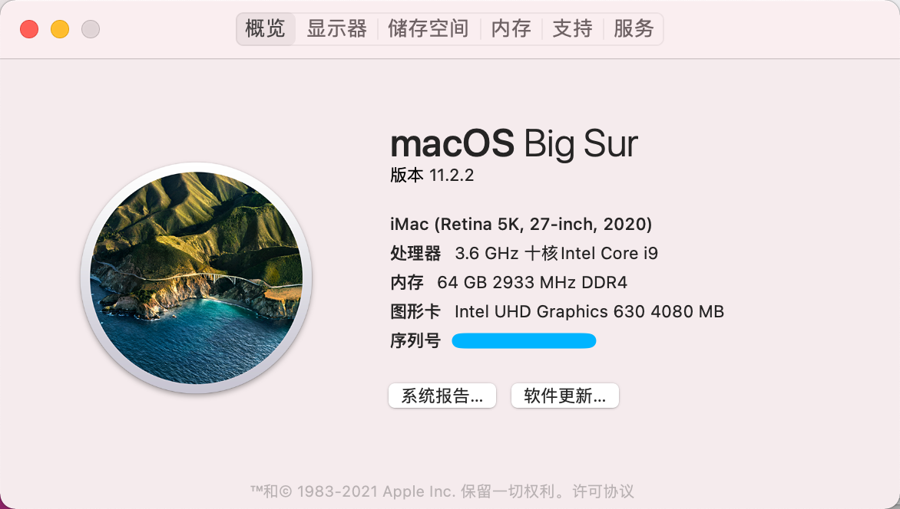
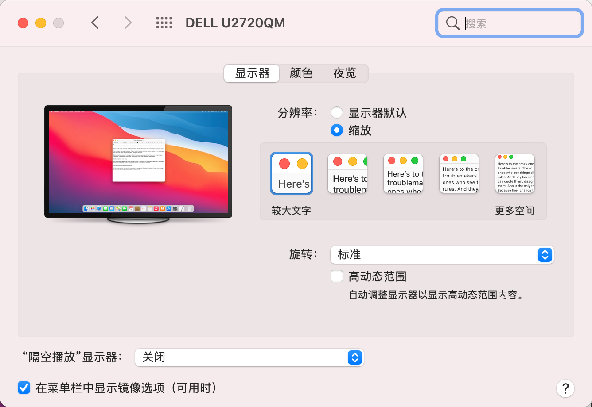
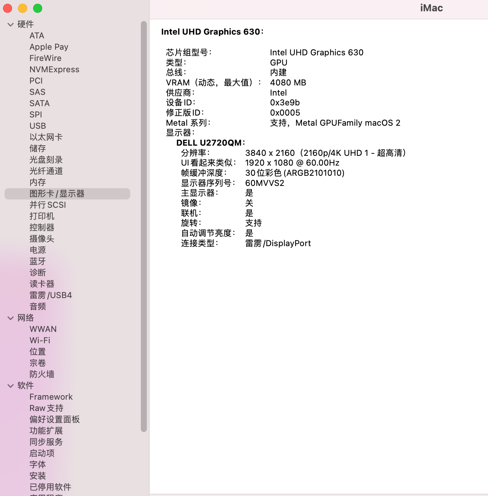
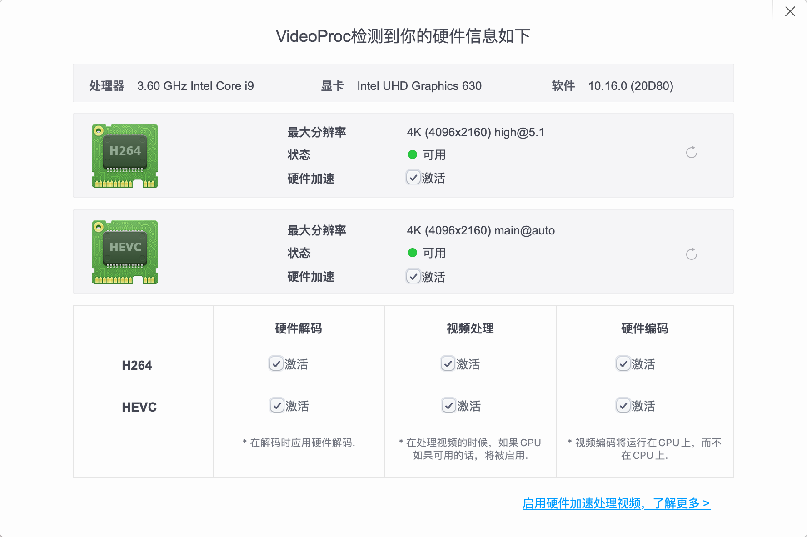
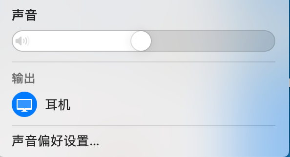
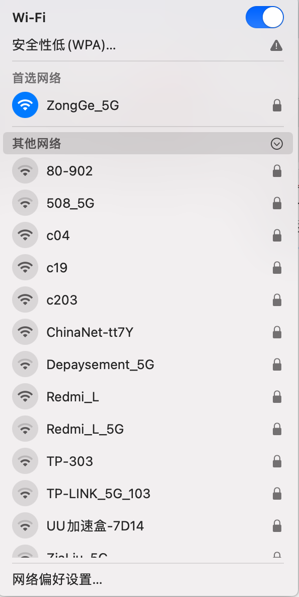

# ASRock-Deskmini-H470-Hackintosh
ASRock-Deskmini-H470-Hackintosh 100% working

macOS Big Sur 11.2.2

硬件:

CPU: i9 10850K

RAM: Samsung 32GB 3200 *2 SODIMM

SSD: SN730 1TB

WiFi: BCM943602CS + 转接卡

SMBIOS 型号：  iMac20,1

iMac20,2会隐藏蓝牙有bug，这里使用IMac20,1

BIOS里面关闭SecureBoot，调整核显显存为最大

前置耳机孔可以输出音频；蓝牙，隔空投送完美。DP接口接显示器以后，显示器的音频输出有bug，暂时无解
HDMI接口未测试，一直使用DP接口完美。
核显设置显存为4GB，4K分辨率下不卡，十分流畅

核显硬解完美正常

